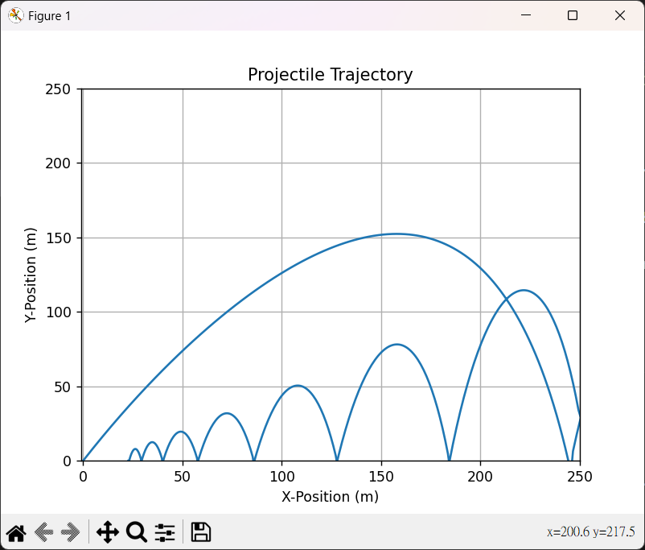

# NA-Midterm
## q1
CODE
```py
from math import pi, cos, sin, tan, sqrt, acos
class Triangle:
    def __init__(self, x1, y1, x2, y2, x3, y3):
        self.x1, self.x2, self.x3 = x1, x2, x3
        self.y1, self.y2, self.y3 = y1, y2, y3

    def edges(self):
        e1 = sqrt((self.x2-self.x3)**2+(self.y2-self.y3)**2)
        e2 = sqrt((self.x3-self.x1)**2+(self.y3-self.y1)**2)
        e3 = sqrt((self.x1-self.x2)**2+(self.y1-self.y2)**2)
        return (e1, e2, e3)
    
    def perimeter(self):
        (a,b,c) = self.edges()
        return a + b + c
    
    def area(self):
        (a,b,c) = self.edges()
        s = (a + b + c) / 2
        triangleArea = sqrt(s * (s - a) * (s - b) * (s - c))
        return triangleArea
    
    def angles(self):
        (a,b,c) = self.edges()
        cosA = (b**2 + c**2 - a**2) / (2 * b * c)
        cosB = (a**2 + c**2 - b**2) / (2 * a * c)
        cosC = (a**2 + b**2 - c**2) / (2 * a * b)
        anglesA = acos(cosA) / pi * 180
        anglesB = acos(cosB) / pi * 180
        anglesC = acos(cosC) / pi * 180
        return (anglesA, anglesB, anglesC)

if (__name__ == '__main__'):
    tr1 = Triangle(0, 0, 0, 3, 4, 0)
    tr2 = Triangle(0, 0, 1, 0, 0, 1)
    # ---------- 1st triangle ---------- #
    print("3 edges of the 1st triangle is: ", tr1.edges())
    print("perimeter of the 1st triangle is: ", tr1.perimeter())
    print("area of the 1st triangle is: ", tr1.area())
    print("3 angles of the 1st triangle is: ", tr1.angles())
    print("")
    # ---------- 2st triangle ---------- #
    print("3 edges of the 2st triangle is: ", tr2.edges())
    print("perimeter of the 2st triangle is: ", tr2.perimeter())
    print("area of the 2st triangle is: ", tr2.area())
    print("3 angles of the 2st triangle is: ", tr2.angles())
```
OUTPUT
```
3 edges of the 1st triangle is:  (5.0, 4.0, 3.0)
perimeter of the 1st triangle is:  12.0
area of the 1st triangle is:  6.0
3 angles of the 1st triangle is:  (90.0, 53.13010235415599, 36.86989764584401)

3 edges of the 2st triangle is:  (1.4142135623730951, 1.0, 1.0)
perimeter of the 2st triangle is:  3.414213562373095
area of the 2st triangle is:  0.4999999999999998
3 angles of the 2st triangle is:  (90.00000000000001, 44.999999999999986, 44.999999999999986)
```

面積使用海龍公式計算。

角度使用三角函數計算。

## q2
CODE
```py
import matplotlib.pyplot as plt
from math import pi, sin, cos

class Boom:
    def __init__(self, mass, v0, angle, gravity, dt):
        self.mass = mass
        self.v0 = v0
        self.v_x = v0 * cos(angle * pi / 180)
        self.v_y = v0 * sin(angle * pi / 180)
        self.a_x = 0.0
        self.a_y = -1 * gravity
        self.angle = angle * pi / 180
        self.gravity = gravity
        self.dt = dt
        self.pos_x = 0
        self.pos_y = 0

    def nextState(self):
        self.pos_x += self.v_x * self.dt
        self.pos_y += self.v_y * self.dt

        nv_x = self.v_x + (self.a_x * self.dt)
        nv_y = self.v_y + (self.a_y * self.dt)  

        self.v_x = nv_x
        self.v_y = nv_y
        return (self.pos_x, self.pos_y)

    def nowState(self):
        return (self.pos_x, self.pos_y)


if __name__ == "__main__":
    boom1 = Boom(1.0, 100.0, 30.0, 9.8, 0.1)
    #boom1 = Boom(1.0, 100.0, 60.0, 9.8, 0.1)
    x_log = [0]
    y_log = [0]
    time = 0

    while boom1.pos_x >= 0 and boom1.pos_y >= 0:
        boom1.nowState()
        print(f"boom1's now state x: {boom1.pos_x:.2f}, y: {boom1.pos_y:.2f} at {time:.1f}s")
        boom1.nextState()
        print(f"boom1's next state x: {boom1.pos_x:.2f}, y: {boom1.pos_y:.2f} at {time:.1f}s")
        print(f"{boom1.dt:.1f} later...\n")

        x_log.append(boom1.pos_x)
        y_log.append(boom1.pos_y)

        time += boom1.dt

# Plot the trajectory
plt.xlim(0, 1000)
plt.ylim(0, 1000)
plt.plot(x_log, y_log)

# Set labels and title
plt.xlabel('X-Position (m)')
plt.ylabel('Y-Position (m)')
plt.title('Projectile Trajectory')

# Add grid
plt.grid(True)

# Show the plot
plt.show()

```
OUTPUT

* boom1 = Boom(1.0, 100.0, 30.0, 9.8, 0.1)


* boom1 = Boom(1.0, 100.0, 60.0, 9.8, 0.1)


修改參數
```py
boom1 = Boom(1.0, 100.0, 30.0, 9.8, 0.1)
``` 
參數分別為(質量, 初速度, 角度, 引力, 時間步伐)，更改上面函式的參數即可使用。

我使用matplotlib中的pyplot來繪圖，```plt.xlim(0, 1000)```以及```plt.ylim(0, 1000)```是我所設定的邊界大小。

## q2
CODE
```py
import matplotlib.pyplot as plt
from math import pi, sin, cos
class BOOM:
    def __init__(self, mass, v0, angle, gravity, dt):
        self.mass = mass
        self.v0 = v0
        self.v_x = v0 * cos(angle * pi / 180)
        self.v_y = v0 * sin(angle * pi / 180)
        self.a_x = 0
        self.a_y = -1 * gravity
        self.angle = angle * pi / 180
        self.gravity = gravity
        self.dt = dt
        self.pos_x = 0
        self.pos_y = 0

    def nextState(self):
        nv_x = self.v_x + (self.a_x * self.dt)
        nv_y = self.v_y + (self.a_y * self.dt)
        self.v_x = nv_x
        self.v_y = nv_y

        self.pos_x += nv_x * self.dt
        self.pos_y += nv_y * self.dt

        return (self.pos_x, self.pos_y)

    def nowState(self):
        return (self.pos_x, self.pos_y)

class FORCEBOOM(BOOM):
    def __init__(self, mass, v0, angle, gravity, dt, cd):
        super().__init__(mass, v0, angle, gravity, dt)
        self.cd = cd
        
    def nextState(self):
        nv_x = self.v_x + (self.a_x * self.dt)
        nv_y = self.v_y + (self.a_y * self.dt)

        if self.v_x != 0 and self.v_y !=0:
            air_resistance_x = -0.5 * self.mass * nv_x**2 * self.cd * (nv_x**2 + nv_y**2) / (nv_x**2 + nv_y**2) * self.dt
            air_resistance_y = -0.5 * self.mass * nv_y**2 * self.cd * (nv_x**2 + nv_y**2) / (nv_x**2 + nv_y**2) * self.dt

        self.v_x = nv_x + air_resistance_x
        self.v_y = nv_y + air_resistance_y

        self.pos_x += self.v_x * self.dt
        self.pos_y += self.v_y * self.dt

        return (self.pos_x, self.pos_y)
    
if (__name__ == '__main__'):
    forceboom1 = FORCEBOOM(1.0, 100.0, 30.0, 9.8, 0.1, 0.01)
    #forceboom1 = FORCEBOOM(1.0, 100.0, 60.0, 9.8, 0.1, 0.01)
    x_log = [0]
    y_log = [0]
    time = 0
    while forceboom1.pos_x >= 0 and forceboom1.pos_y >= 0:
        forceboom1.nowState()
        print(f"boom1's now state x: {forceboom1.pos_x:.2f}, y: {forceboom1.pos_y:.2f} at {time:.1f}s")
        forceboom1.nextState()
        print(f"boom1's next state x: {forceboom1.pos_x:.2f}, y: {forceboom1.pos_y:.2f} at {time:.1f}s")
        print(f"{forceboom1.dt:.1f} later...\n")

        x_log.append(forceboom1.pos_x)
        y_log.append(forceboom1.pos_y)

        time += forceboom1.dt

    # Plot the trajectory
    plt.xlim(0, 300)
    plt.ylim(0, 300)
    plt.plot(x_log, y_log)

    # Set labels and title
    plt.xlabel('X-Position (m)')
    plt.ylabel('Y-Position (m)')
    plt.title('Projectile Trajectory')

    # Add grid
    plt.grid(True)

    # Show the plot
    plt.show()
```
OUTPUT

* forceboom1 = forceBoom(1.0, 100.0, 30.0, 9.8, 0.1, 0.01)


* forceboom1 = forceBoom(1.0, 100.0, 60.0, 9.8, 0.1, 0.01)


修改參數
```py
forceboom1 = forceBoom(1.0, 100.0, 30.0, 9.8, 0.1, 0.01)
```

q3與q2大同小異只是多了使用繼承CLASS BOOM```class FORCEBOOM(BOOM)```且多一個參數空氣阻力cd，所以參數分別為(質量, 初速度, 角度, 引力, 時間步伐, 空氣阻力)，修改上面參數即可。

邊界大小設定大小為300。

## q4
CODE
```py
import matplotlib.pyplot as plt
from math import pi, sin, cos

class BORDERBOOM:
    def __init__(self, x_border, y_border, mass, v0, angle, gravity, dt, cd):
        self.x_border = x_border
        self.y_border = y_border
        self.mass = mass
        self.v0 = v0
        self.v_x = v0 * cos(angle * pi / 180)
        self.v_y = v0 * sin(angle * pi / 180)
        self.a_x = 0
        self.a_y = -1 * gravity
        self.angle = angle * pi / 180
        self.gravity = gravity
        self.dt = dt
        self.cd = cd

        self.pos_x = 0
        self.pos_y = 0

    def nextState(self):
        nv_x = self.v_x + (self.a_x * self.dt)
        nv_y = self.v_y + (self.a_y * self.dt)

        if self.v_x != 0 and self.v_y !=0:
            air_resistance_x = -0.5 * self.mass * nv_x**2 * self.cd * (nv_x**2 + nv_y**2) / (nv_x**2 + nv_y**2) * self.dt
            air_resistance_y = -0.5 * self.mass * nv_y**2 * self.cd * (nv_x**2 + nv_y**2) / (nv_x**2 + nv_y**2) * self.dt

        self.v_x = nv_x + air_resistance_x
        self.v_y = nv_y + air_resistance_y

        if abs(nv_x - self.v_x) < 0.1 and self.pos_x <= 0:
            self.v_x = 0

        if self.pos_x > self.x_border:
            self.pos_x = self.x_border
            self.v_x *= -0.7

        if self.pos_x < 0:
            self.pos_x = 0
            self.v_x *= -0.7

        if abs(nv_y - self.v_y) < 0.1 and self.pos_y <= 0:
            self.v_y = 0

        if self.pos_x > self.y_border:
            self.pos_x = self.y_border
            self.v_x *= -0.7

        if self.pos_y < 0 :
            self.pos_y = 0
            self.v_y *= -0.7

        self.pos_x += self.v_x * self.dt
        self.pos_y += self.v_y * self.dt

        return (self.pos_x, self.pos_y)
    
    def nowState(self):
        return (self.pos_x, self.pos_y)
    
if (__name__ == '__main__'):
    borderboom1 = BORDERBOOM(250.0, 250.0, 1.0, 100.0, 60.0, 9.8, 0.1, 0.01)
    #borderboom1 = BORDERBOOM(500.0, 500.0, 1.0, 100.0, 60.0, 9.8, 0.1, 0.01)
    x_log = [0]
    y_log = [0]
    time = 0
    while borderboom1.v_x != 0 and borderboom1.v_y != 0:
        borderboom1.nowState()
        print(f"boom1's now state x: {borderboom1.pos_x:.2f}, y: {borderboom1.pos_y:.2f} at {time:.1f}s, vx: {borderboom1.v_x:.2f}, vy: {borderboom1.v_y:.2f}")
        borderboom1.nextState()
        print(f"boom1's next state x: {borderboom1.pos_x:.2f}, y: {borderboom1.pos_y:.2f} at {time:.1f}s")
        print(f"{borderboom1.dt:.1f} later...\n")

        x_log.append(borderboom1.pos_x)
        y_log.append(borderboom1.pos_y)

        time += borderboom1.dt

    # Plot the trajectory
    plt.xlim(-1, borderboom1.x_border)
    plt.ylim(0, borderboom1.y_border)
    plt.plot(x_log, y_log)

    # Set labels and title
    plt.xlabel('X-Position (m)')
    plt.ylabel('Y-Position (m)')
    plt.title('Projectile Trajectory')

    # Add grid
    plt.grid(True)

    # Show the plot
    plt.show()
```
OUTPUT

* borderboom1 = BORDERBOOM(250.0, 250.0, 1.0, 100.0, 60.0, 9.8, 0.1, 0.01)


* borderboom1 = BORDERBOOM(500.0, 500.0, 1.0, 100.0, 60.0, 9.8, 0.1, 0.01)


修改參數
```py
borderboom1 = BORDERBOOM(250.0, 250.0, 1.0, 100.0, 60.0, 9.8, 0.1, 0.01)
```

q4與前面兩題的也是大同小異只是多了設定邊界以及反彈，所以參數分別為(X邊界, Y邊界, 質量, 初速度, 角度, 引力, 時間步伐, 空氣阻力)，修改上面參數即可。

邊界設定為
```py
plt.xlim(-1, borderboom1.x_border)
plt.ylim(0, borderboom1.y_border)
```
以及反彈時會損失能量，這邊這設定為0.7，當速度差距<0.1時，則代表能量已經消耗完，所以變為0，在```abs(nv_x - self.v_x) < 0.1 and self.pos_x <= 0```中的```self.pos_x <= 0```以及```abs(nv_y - self.v_y) < 0.1 and self.pos_y <= 0```中的```self.pos_y <= 0```則是判斷速度差距<0.1時，位置是否為不合理處，**像是在拋物運動的頂點時，速度差也是<0.1但位置在合理處**，則速度不設定為0。
```py
if abs(nv_x - self.v_x) < 0.1 and self.pos_x <= 0:
    self.v_x = 0

if self.pos_x > self.x_border:
    self.pos_x = self.x_border
    self.v_x *= -0.7

if self.pos_x < 0:
    self.pos_x = 0
    self.v_x *= -0.7

if abs(nv_y - self.v_y) < 0.1 and self.pos_y <= 0:
    self.v_y = 0

if self.pos_x > self.y_border:
    self.pos_x = self.y_border
    self.v_x *= -0.7

if self.pos_y < 0 :
    self.pos_y = 0
    self.v_y *= -0.7
```
